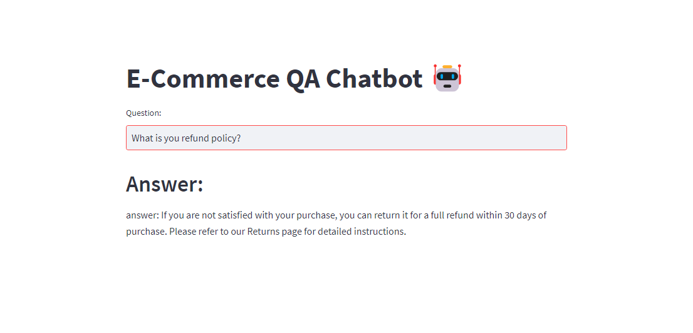

# E-Commerce Chatbot: Question and Answer System Based on Google Palm LLM and Langchain for E-commerce company  

This is an end to end LLM project based on Google Palm and Langchain. We are building a Q&A system for an e-learning company.
The dataset is freely available on Kaggle. This system will provide a streamlit based user interface for customers where they can ask questions and get answers.
[Dataset link](https://www.kaggle.com/datasets/saadmakhdoom/ecommerce-faq-chatbot-dataset/)



## Project Highlights

- Used a CSV file of FAQs obtained from Kaggle. 
- The human staff of the e-commerce company can use this file to assist their customers.
- We will build an LLM based question and answer system that can reduce the workload of their human staff.
- Customers should be able to use this system to ask questions directly and get answers within seconds

## Technical Stack Used
  - Langchain + Google Palm: LLM based Q&A
  - Streamlit: UI
  - Huggingface instructor embeddings: Text embeddings
  - FAISS: Vector database

## Installation

1.Clone this repository to your local machine using:

```bash
  git clone https://github.com/subhradeep25-gan/E-Commerce-Chatbot
```
2.Acquire an api key through makersuite.google.com and put it in a file named secret_key.py

```bash
  GOOGLE_API_KEY="your_api_key_here"
```
## Usage

1. Run the Streamlit app by executing:
```bash
streamlit run main.py

```

2.Ask a question in the given box and press enter key on keyboard.
The Chatbot will reply you back with the relevant answer to your question in a few seconds

## Sample Questions
1. What is your return policy?
2. Can I change my shipping address after placing an order?
3. How can I leave a product review?
4. Can I return a product without a receipt or if it was purchased with a gift card?
5. How long does shipping take?

## Project Structure

- main.py: The main Streamlit application script.
- ecommerce_google_palm_chatbot.py: This has all the langchain code
- .env: File for storing your Google API key.
- output.csv: This the csv file of the ECommerce FAQ data
